# 1 Crear un proyecto

<iframe width="960" height="540" src="https://www.youtube.com/embed/NxXjfANWB8U" title="YouTube video player" frameborder="0" allow="accelerometer; autoplay; clipboard-write; encrypted-media; gyroscope; picture-in-picture" allowfullscreen></iframe>

Para crear un proyecto, se utiliza el comando

```
composer create-project symfony/skeleton nombre-proyecto
```

Que creará un proyecto con el nombre indicado en la carpeta actual, conteniendo la estructura mínima, sin librerías de terceros. Será nuestra responsabilidad añadirlas más tarde. Esta funcionalidad ha sido añadida en la versión 4 de Symfony, para permitir que se instale como microframework y no dejar un proyecto demasiado pesado para nuestras necesidades.

```
composer create-project symfony/website-skeleton nombre-proyecto
```

Que hace lo mismo que la opción anterior, pero rellena el proyecto con una serie de dependencias ya instaladas de serie. Esta opción se deja por comodidad, y por motivos de "tradición", para que los desarrolladores que venían utilizando Symfony en sus versiones anteriores no aprecien cambios significativos al crear proyectos con las dependencias habituales ya instaladas. En versiones anteriores, se instalaba lo que se conocía como Symfony Standard Edition, que era una versión mucho más extensa, con varias dependencias preinstaladas.
Suele ser bastante habitual emplear esta segunda opción para crear proyectos, ya que, aunque nos instala dependencias que puede que no lleguemos a utilizar, sí nos instala automáticamente otras muy requeridas, como el motor de plantillas Twig, el ORM Doctrine, o el gestor de logs Monolog.
Para empezar, vamos a crear un proyecto llamado "**contactos**" con la segunda opción. Accedemos a la carpeta de trabajo, y escribimos este comando desde dentro de esa carpeta:

```
composer create-project symfony/website-skeleton symfony-contactos
```

Este comando generará un proyecto con la siguiente estructura:

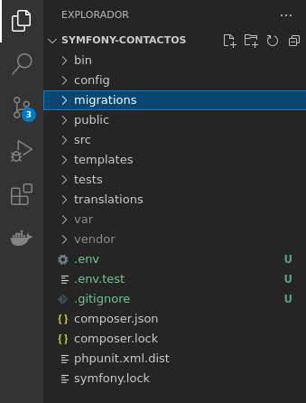


## 1.2 Inicio

<iframe width="960" height="540" src="https://www.youtube.com/embed/_UKL0QSbl8k" title="YouTube video player" frameborder="0" allow="accelerometer; autoplay; clipboard-write; encrypted-media; gyroscope; picture-in-picture" allowfullscreen></iframe>

Vamos a crear nuestro primer controlador.

```
php bin/console make:controller PageController
```

Este comando genera un controlador `PageController` en la carpeta `src/Controller`. El código que genera es el siguiente:

```php
<?php

namespace App\Controller;

use Symfony\Bundle\FrameworkBundle\Controller\AbstractController;
use Symfony\Component\HttpFoundation\Response;
use Symfony\Component\Routing\Annotation\Route;

class PageController extends AbstractController
{
    /**
     * @Route("/page", name="page")
     */
    public function index(): Response
    {
        return $this->render('page/index.html.twig', [
            'controller_name' => 'PageController',
        ]);
    }
}
```

Es muy parecido a los controladores de Slim: asocia una ruta a un método. Lo que lo diferencia es que la ruta se define con una anotación antes del nombre del método. En este ejemplo, asocia el método `index` con la ruta `/page/` y renderiza la plantilla `page/index.html.twig` (más adelante veremos el uso de plantillas).

Vamos a levantar un servidor mediante el comando `php -S 127.0.0.1:8080` dentro de la carpeta `public`

Si ahora visitamos la página [http://127.0.0.1:8080/page](http://127.0.0.1:8080/page) este será el resultado:

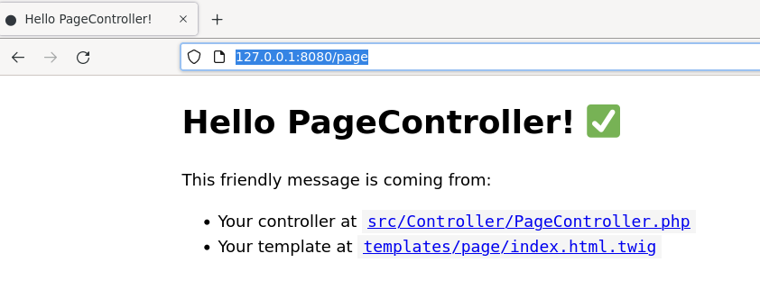

Vemos que el código renderiza la plantilla `page/index.html.twig` pasándole como parámetro `controller_name` tal y como hacíamos con Slim

Ahora crea un controlador para la ruta para `/` llamado `inicio` con el siguiente código:

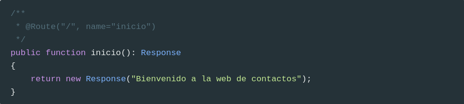

Al visitar la url [http://127.0.0.1:8080/](http://127.0.0.1:8080/) este será el resultado:

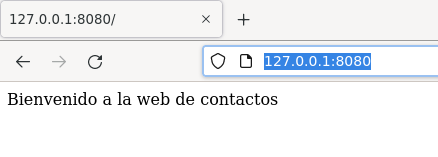

## 1.3 Ficha

<iframe width="960" height="540" src="https://www.youtube.com/embed/hixXPfIbPKQ" title="YouTube video player" frameborder="0" allow="accelerometer; autoplay; clipboard-write; encrypted-media; gyroscope; picture-in-picture" allowfullscreen></iframe>

Vamos a crear la ficha del contacto. Para ello crea otro controlador llamado `ContactoController`:

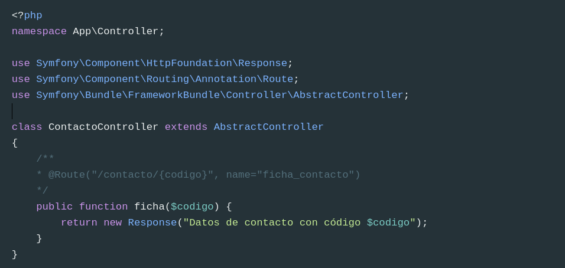

En este caso vemos el uso de los parámetros en los controladores. El parámetro `codigo` será automáticamente inyectado por Symfony,

Por ejemplo, si visitas la página [http://127.0.0.1:8080/contacto/2](http://127.0.0.1:8080/contacto/2) se mostrará la siguiente ventana:

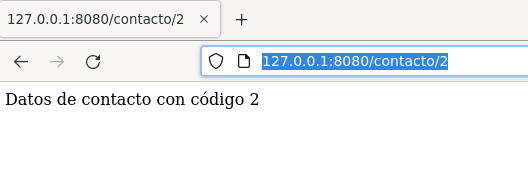

### 1.3.1 Base de datos

Como todavía no vamos a conectarnos a un base de datos, vamos a usar un array asociativo para almacenar una serie de contactos, así que los añadimos como una propiedad en la clase `ContactoController`.

```php
class ContactoController extends AbstractController
{
    private $contactos = [
        1 => ["nombre" => "Juan Pérez", "telefono" => "524142432", "email" => "juanp@ieselcaminas.org"],
        2 => ["nombre" => "Ana López", "telefono" => "58958448", "email" => "anita@ieselcaminas.org"],
        5 => ["nombre" => "Mario Montero", "telefono" => "5326824", "email" => "mario.mont@ieselcaminas.org"],
        7 => ["nombre" => "Laura Martínez", "telefono" => "42898966", "email" => "lm2000@ieselcaminas.org"],
        9 => ["nombre" => "Nora Jover", "telefono" => "54565859", "email" => "norajover@ieselcaminas.org"]
    ];     
```

Y modificamos el controlador, para que ahora nos muestre los datos del contacto pasado como parámetro:

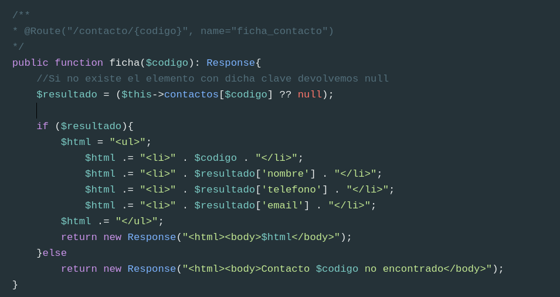

## 1.4 Buscar

<iframe width="960" height="540" src="https://www.youtube.com/embed/jwpO9q8Ne_Q" title="YouTube video player" frameborder="0" allow="accelerometer; autoplay; clipboard-write; encrypted-media; gyroscope; picture-in-picture" allowfullscreen></iframe>

Vamos a crear una ruta para buscar contactos por nombre. La ruta va a ser la siguiente: `/contacto/buscar/texto`. Para ello creamos la ruta y el controlador:

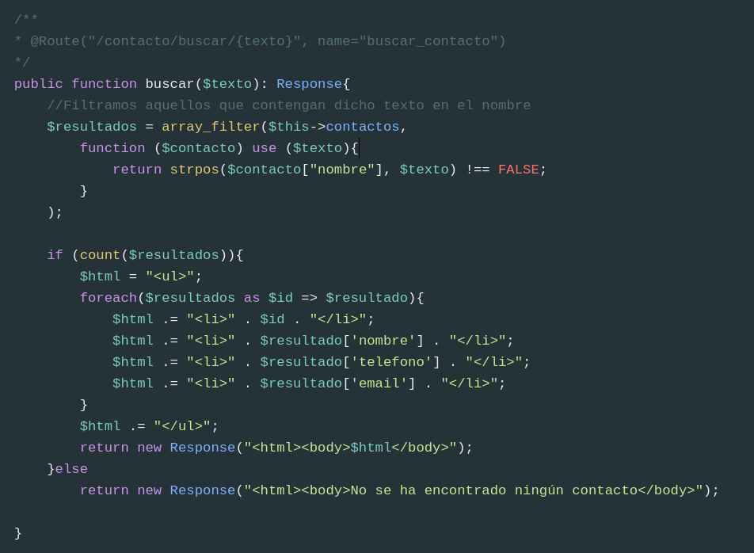

Al visitar la url (http://127.0.0.1:8080/contacto/Ma), obtendremos como resultado 

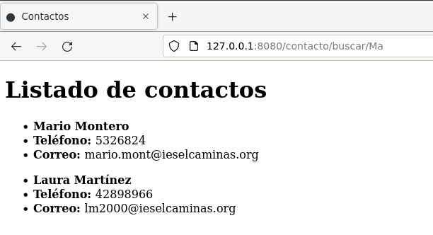

### 1.4.1 Añadir valores predeterminados

En algunas ocasiones, también nos puede interesar dar un valor por defecto a una wildcard para que, si en la ruta no se especifica nada, tenga dicho valor por defecto. Esto se consigue asignando un valor por defecto al parámetro asociado en el controlador. En el caso de la ficha del contacto anterior, si quisiéramos que cuando se introduzca la ruta `/contacto` (sin código), se mostrara por defecto el contacto con código 1, haríamos esto:

```php
/**
* @Route("/contacto/{codigo<\d+>?1}", name="ficha_contacto")
*/
```

## 1.5 Plantillas

<iframe width="960" height="540" src="https://www.youtube.com/embed/L0NDMjSNKYs" title="YouTube video player" frameborder="0" allow="accelerometer; autoplay; clipboard-write; encrypted-media; gyroscope; picture-in-picture" allowfullscreen></iframe>

Vamos a crear nuestra primera plantilla, `inicio.html.twig` en la carpeta `templates`.

```html
<!doctype html>
<html>
<meta charset="utf-8">
<body>
	<h1>Contactos</h1>
	<h2>Bienvenido a la web de contactos.</h2>
	<p>Página de inicio</p>
</body>
</html>
```

y modificamos también el método `inicio` del controlador `PageController` para que, en lugar de mostrar una respuesta de texto plano, renderice la vista `inicio.html.twig` que acabamos de hacer. Para ello, el código será el siguiente:


Observa que se utiliza `$this`. Esto es así porque el controlador hereda de `AbstractController` y este es uno de los métodos que posee.

### 1.5.1 Plantillas con partes variables

La plantilla anterior no es algo demasiado habitual, ya que únicamente contiene texto estático. Lo normal es que haya alguna parte que varíe, y que le sea proporcionada desde el controlador.

Vamos a ver un ejemplo. Para ello creamos `ficha_contacto.html.twig` con el siguiente contenido:

```twig
<!doctype html>
<html>
<meta charset="utf-8">
<body>
    <h1>Ficha del contacto</h1>
    <ul>
        <li><strong>{{ contacto.nombre}}</strong></li>
        <li><strong>Teléfono: </strong>{{ contacto.telefono}}</li>
        <li><strong>Correo: </strong>{{ contacto.email}}</li>
    </ul>
</body>
</html>
```

Empleamos la notación de la doble llave `{{ ... }}` para ubicar variables, que normalmente son datos que esperamos recibir de fuera (del controlador, en este caso). Nos faltaría, en el método `ficha` de `ContactoController`, obtener el contacto deseado (eso ya lo tenemos hecho) y pasárselo a la vista, de este modo:

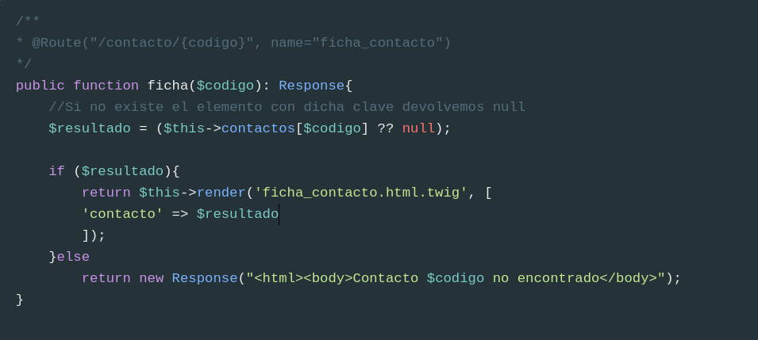

Lo único que ha variado es que ahora renderizamos una vista.

### 1.5.2 Estructuras de control en plantillas

La plantilla anterior es un ejemplo para añadir partes dinámicas en el contenido de la misma, pero está algo *coja*: ¿qué pasa si no encontramos el contacto en la lista? En este caso, el controlador se limita a devolver una respuesta de texto plano que dice "Contacto no encontrado", pero podríamos emplear la misma vista (u otra) para mostrar esta información más *decorada*. Así, el controlador renderizará la misma vista, pasándole un contacto válido o nulo, según el caso:

```php
/**
* @Route("/contacto/{codigo}", name="ficha_contacto")
*/
public function ficha($codigo): Response{
    //Si no existe el elemento con dicha clave devolvemos null
    $resultado = ($this->contactos[$codigo] ?? null);

    return $this->render('ficha_contacto.html.twig', [
    'contacto' => $resultado
    ]);
}
```

y la vista distinguirá si hay o no contacto, para mostrar una u otra información:

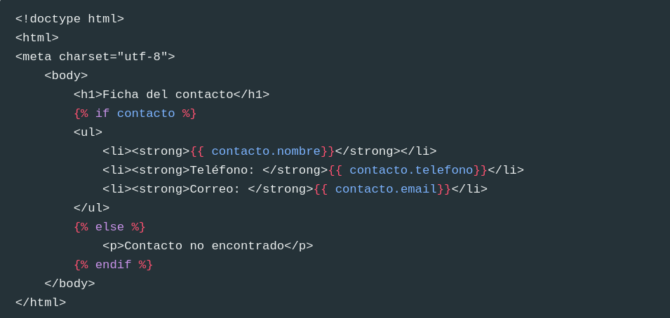

Observa cómo hemos incluido un bloque ``, que son **bloques de acción**, empleados para definir ciertas sentencias de control (condiciones, bucles) e incluir dentro el código asociado a dicha sentencia.

Del mismo modo, para el controlador de búsqueda de contactos por nombre, podemos crear una nueva vista (por ejemplo, `lista_contactos.html.twig`), que muestre el listado de contactos que reciba ya filtrado del controlador:

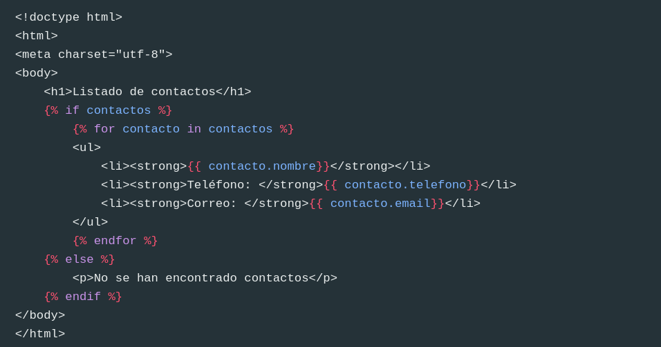

Así, el código del controlador se limitará a filtrar los contactos y pasárselos a la vista:

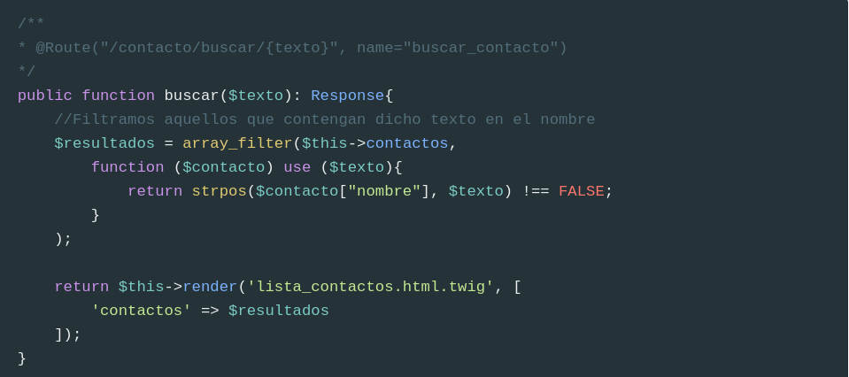

### 1.5.3 Herencia de plantillas

La herencia de plantillas nos permite reaprovechar el código de unas en otras. En realidad, esto es algo muy habitual en el diseño web: que todas las páginas (o varias) de una web compartan la misma cabecera y pie, por ejemplo. Así, podemos definir una estructura o layout base en una plantilla, y hacer que otra(s) hereden de ella para rellenar ciertos huecos. Veamos un ejemplo con nuestra web de contactos.

En primer lugar, definiremos la plantilla base. Tenéis un ejemplo en que basaros ya hecho, en el archivo `templates/base.html.twig`, que proporciona un esqueleto parecido a este que podríamos aprovechar para muchas aplicaciones:

```twig
<!DOCTYPE html>
<html>
    <head>
        <meta charset="UTF-8">
        <title>Welcome!</title>
        <link rel="icon" href="data:image/svg+xml,<svg xmlns=%22http://www.w3.org/2000/svg%22 viewBox=%220 0 128 128%22><text y=%221.2em%22 font-size=%2296%22>⚫️</text></svg>">
        {# Run `composer require symfony/webpack-encore-bundle` to start using Symfony UX #}
        
            {{ encore_entry_link_tags('app') }}
        

        
            {{ encore_entry_script_tags('app') }}
        
    </head>
    <body>
        
    </body>
</html>

```

Como podemos observar, la parte *rellenable* de la plantilla se define mediante bloques (`blocks`), de forma que en las diferentes subplantillas podemos indicar qué bloques de la plantilla padre queremos rellenar. Por ejemplo, vamos a definir una subplantilla para la página de inicio. Retocamos nuestra plantilla `inicio.html.twig` y la dejamos así:

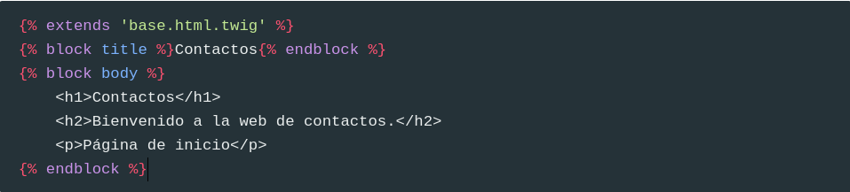

Es importante que, si una plantilla hereda de otra, el primer código que haya en esa plantilla (sin contar comentarios previos) sea una instrucción `` para indicar que es una herencia. Después, basta con rellenar los bloques cuyo contenido queramos modificar o establecer: en este ejemplo, los bloques `title` y `body`, definidos en la plantilla base.

Del mismo modo, definiríamos la plantilla `ficha_contacto.html.twig`

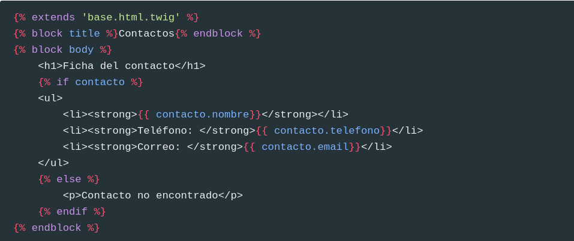

Y `lista_contactos.html.twig`:

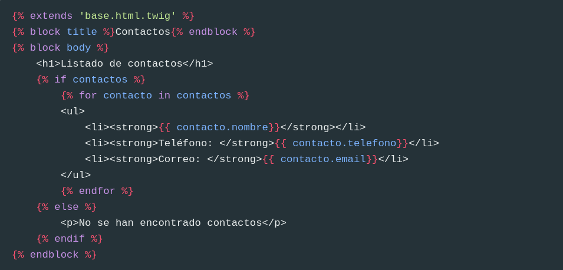

### 1.5.4 Incluir plantillas dentro de otras

Otra opción interesante, aparte de la herencia, es la de poder incluir una plantilla como parte del contenido de otra. Basta con utilizar la instrucción `include`, seguida del nombre de la plantilla y, si los necesita, sus parámetros asociados. Por ejemplo, podríamos sacar la lista de datos de un contacto a una plantilla llamada `partials/datos_contacto.html.twig`:

```php
<ul>
    <li><strong>{{ contacto.nombre }}</strong></li>
    <li><strong>Teléfono</strong>: {{ contacto.telefono }}</li>
    <li><strong>E-mail</strong>: {{ contacto.email }}</li>
</ul>
```

E incluirla tanto en `ficha_contacto.html.twig`


Como en  `lista_contactos.html.twig`:


### 1.5.5 Añadir contenido estático en plantillas

Para ilustrar cómo añadir contenido estático en plantillas (archivos de estilo, javascript e imágenes), vamos a definir en nuestra carpeta `public` de la web de contactos una subcarpeta `css`, y dentro un archivo `estilos.css` (que quedará, por tanto, en `public/css/estilos.css`). Definimos dentro un estilo básico para probar. Por ejemplo:

```css
body
{
    background-color: #99ccff;
}

h1
{
    border-bottom: 1px solid black;
}
```

Ahora, vamos a añadir este estilo a nuestra web. Como tenemos un bloque `stylesheets` en nuestra plantilla `base.html.twig`, podemos aprovecharlo e incluir el CSS dentro de dicho bloque, para que lo utilicen todas las subplantillas:

```twig
<!DOCTYPE html>
<html>
    <head>
        <meta charset="UTF-8">
        <meta name="viewport" content="width=device-width, initial-scale=1">
        <title>Welcome!</title>
        
            <link href="{{ asset('css/estilos.css') }}" rel="stylesheet" />
        
    </head>
    <body>
        
        
    </body>
</html>
```

## Más información

Tenéis más información sobre plantillas en el aparatado correspondiente del aula virtual.

