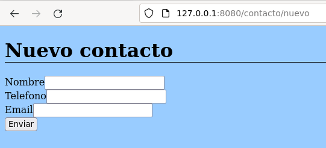
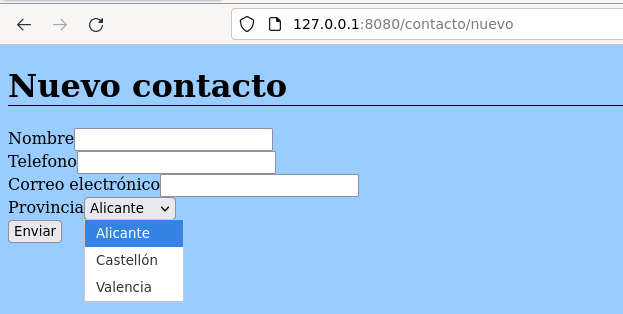
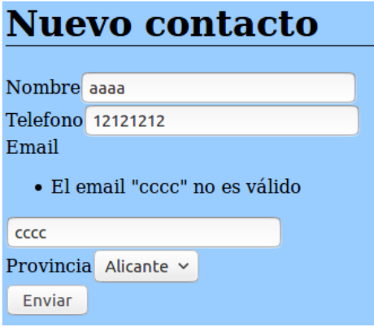
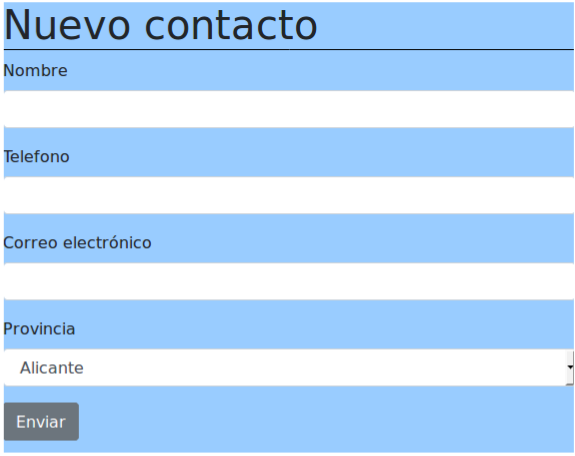
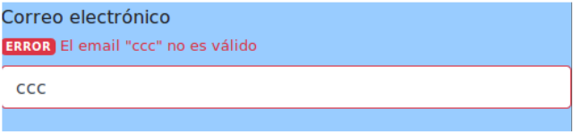

# 3 Generación de formularios

<iframe width="960" height="540" src="https://www.youtube.com/embed/YZzLjD8PSDM" title="YouTube video player" frameborder="0" allow="accelerometer; autoplay; clipboard-write; encrypted-media; gyroscope; picture-in-picture" allowfullscreen></iframe>

Hasta este apartado hemos aprendido algunos conceptos útiles de Symfony y algunos de sus bundles más destacados, como por ejemplo la generación de vistas con el motor de plantillas Twig y  la comunicación con la base de datos a través del ORM Doctrine. Hemos hecho algunos controladores de ejemplo para buscar datos, o para insertar. Pero, en este último caso, al no disponer aún de un mecanismo para que se envíen datos de inserción desde el cliente, hemos optado por ahora por insertar unos datos prefijados o dummy data, es decir, un contacto con unos datos ya predefinidos en el código.

En este apartado veremos de qué forma se pueden definir formularios en Symfony asociados a una determinada entidad, para que lo que se envíe en el formulario se asocie a un objeto de dicha entidad, y para que podamos pre­cargar el formulario con los datos de una entidad ya existente, con el fin de poderlos modificar.

## 3.1 Creación del formulario en el controlador

Los formularios pueden crearse fácilmente desde cualquier controlador. Basta con que creemos u obtengamos el objeto asociado al formulario (por ejemplo, un contacto), y carguemos un formulario con él. En nuestra aplicación de contactos, vamos a crear un nuevo controlador que responda a la URI `/contacto/nuevo`, y que cree un contacto vacío y muestre el formulario.

```php
namespace App\Controller;
...
use Symfony\Component\Form\Extension\Core\Type\TextType;
use Symfony\Component\Form\Extension\Core\Type\SubmitType;
class ContactoController extends AbstractController
{
...
	/**
	* @Route("/contacto/nuevo", name="nuevo_contacto")
	*/
	public function nuevo() {
		$contacto = new Contacto();

		$formulario = $this->createFormBuilder($contacto)
			->add('nombre', TextType::class)
			->add('telefono', TextType::class)
			->add('email', TextType::class)
			->add('save', SubmitType::class, array('label' => 'Enviar'))
			->getForm();
		
		return $this->render('nuevo.html.twig', array(
			'formulario' => $formulario->createView()
		));
	}
...
```

Como podemos ver, a través del `form builder` de Symfony se crea el formulario. Después, añadimos tantos campos como atributos tenga la entidad (normalmente), asociando cada atributo con su campo por el nombre.

En cada campo especificamos también de qué tipo es. En nuestro caso, hemos definido tres cuadros de texto (`TextType`) para el nombre, teléfono y  e­mail, y un botón de `submit` (`SubmitType`) para poder enviar el formulario. Podéis consultar aquí un listado más detallado de los tipos de campos que tenemos disponibles. Algunos que pueden resultarnos interesantes son:

* `TextType` (cuadros de texto de una sola línea, como el ejemplo anterior)

* `TextareaType` (cuadros de texto de varias líneas)
* `EmailType` (cuadros de texto de tipo e­mail)
* `IntegerType` (cuadros de texto para números enteros)
* `NumberType` (cuadros de texto para números en general)
* `PasswordType` (cuadros enmascarados para passwords)
* `EntityType` (desplegables para elegir valores vinculados a otra entidad)
* `DateType` (para fechas)
* `CheckboxType` (para checkboxes)
* `RadioType` (para botones de radio o radio buttons)
* `HiddenType` (para controles ocultos)
* ... etc.

### 3.1.1 Renderizando el formulario

El código del controlador anterior termina renderizando una vista llamada `nuevo.html.twig` que, por ahora, no existe. En esta vista deberemos renderizar el formulario. Podría quedar así:

```twig


Contactos

    <h1>Nuevo contacto</h1>
    {{ form(formulario) }}    

```

La línea debajo del encabezado `h1` es la responsable de la renderización del formulario propiamente dicho, a partir del parámetro formulario que le pasamos desde el controlador.
Si ahora accedemos a http://127.0.0.1:8080/contacto/nuevo podremos ver el formulario:



### 3.1.2 Etiquetas personalizadas

Como podemos ver para el caso del botón de `submit`, podemos especificar un tercer parámetro en el método `add` que es un array de propiedades del control en cuestión. Una de ellas es la propiedad `label`, que nos permite especificar qué texto tendrá asociado el control. Por defecto, se asocia el nombre del atributo correspondiente en la entidad, pero podemos cambiarlo por un texto personalizado. Para el `e­mail`, por ejemplo, podríamos poner:

```php
->add('email', EmailType::class, array('label' => 'Correo electrónico'))
```


### 3.1.3 Mejorando nuestro formulario

Aprovechando la variedad de tipos de campos que ofrece Symfony, vamos a mejorar un poco nuestro formulario añadiendo el dato Provincia que vimos en el apartado de `Doctrine`. Para ello podemos emplear un `EntityType` que tome sus datos de la entidad `Provincia`.

Con esto, el formulario quedaría así:

```php
use Symfony\Component\Form\Extension\Core\Type\EmailType;
use Symfony\Bridge\Doctrine\Form\Type\EntityType;
...
	public function nuevo() {
	...
		$formulario = $this->createFormBuilder($contacto)
			->add('nombre', TextType::class)
			->add('telefono', TextType::class)
			->add('email', EmailType::class, array('label' => 'Correo electrónico'))
			->add('provincia', EntityType::class, array(
				'class' => Provincia::class,
				'choice_label' => 'nombre',))
			->add('save', SubmitType::class, array('label' => 'Enviar'))
			->getForm();
	...
```



**Automáticamente obtiene los datos de la provincia de la base de datos**

## 3.2 Envío de formularios

<iframe width="960" height="540" src="https://www.youtube.com/embed/2X2Q98eXgMg" title="YouTube video player" frameborder="0" allow="accelerometer; autoplay; clipboard-write; encrypted-media; gyroscope; picture-in-picture" allowfullscreen></iframe>

Hablemos ahora sobre cómo enviar el formulario. Por defecto, si no se indica nada, el formulario se envía por `POST` a la misma URI que lo genera (en nuestro caso, a `/contacto/nuevo`). De hecho, si intentamos enviar el formulario en este momento, con los datos que sean, se volverá a cargar la vista del formulario, pero no habremos insertado nada.

Para gestionar el envío de estos datos, hay que hacer algunas modificaciones sobre nuestro controlador:

* En primer lugar, el controlador recibirá un objeto `Request`, que contendrá los datos del formulario enviado (en el caso de que se haya enviado):

* En segundo lugar, dentro del código del controlador, debemos procesar esos datos (si los hay), validarlos (esto lo veremos a continuación) y si son válidos, realizar la correspondiente inserción o modificación.
* Finalmente, podemos redirigir a otra ruta en caso de éxito, o volver a renderizar el formulario en caso de error, o en caso de que no se haya enviado (por ejemplo, cuando cargamos el formulario para rellenarlo).

Uniendo estas premisas, nuestro controlador quedaría así:

```php
/**
* @Route("/contacto/nuevo", name="nuevo_contacto")
*/
public function nuevo(ManagerRegistry $doctrine, Request $request) {
    $contacto = new Contacto();

    
    $formulario = $this->createFormBuilder($contacto)
        ->add('nombre', TextType::class)
        ->add('telefono', TextType::class)
        ->add('email', EmailType::class, array('label' => 'Correo electrónico'))
        ->add('provincia', EntityType::class, array(
            'class' => Provincia::class,
            'choice_label' => 'nombre',))
        ->add('save', SubmitType::class, array('label' => 'Enviar'))
        ->getForm();
        $formulario->handleRequest($request);

        if ($formulario->isSubmitted() && $formulario->isValid()) {
            $contacto = $formulario->getData();
            $entityManager = $doctrine->getManager();
            $entityManager->persist($contacto);
            $entityManager->flush();
            return $this->redirectToRoute('ficha_contacto', ["codigo" => $contacto->getId()]);
        }
        return $this->render('nuevo.html.twig', array(
            'formulario' => $formulario->createView()
        ));
}
```

Si probamos ahora a cargar el formulario y realizar una inserción, nos enviará a la página de inicio, y podremos ver el nuevo contacto presente en la tabla correspondiente de la base de datos.

### 3.2.1 Modificación de datos

Lo que hemos hecho en el ejemplo anterior es una inserción de un nuevo contacto, pero... ¿cómo sería hacer una modificación de contacto existente?. El funcionamiento sería muy similar, pero con un pequeño cambio: la ruta del controlador recibirá como parámetro el código del contacto a modificar, y a partir de ahí, buscaríamos el contacto y lo cargaríamos en el formulario, incluyendo su `id`. De esta forma, al hacer `persist` se modificaría el contacto existente.

Podemos probarlo con este controlador:

```php
/**
* @Route("/contacto/editar/{codigo}", name="editar_contacto",
requirements={"codigo"="\d+"})
*/
public function editar(Request $request, $codigo) {

	$repositorio = $this->getDoctrine()->getRepository(Contacto::class);

	$contacto = $repositorio->find($codigo);

	$formulario = $this->createFormBuilder($contacto)
		->add('nombre', TextType::class)
		->add('telefono', TextType::class)
		->add('email', EmailType::class)
		->add('provincia', EntityType::class, array(
			'class' => Provincia::class,
			'choice_label' => 'nombre',))
		->add('save', SubmitType::class, array('label' => 'Enviar'))
		->getForm();

	$formulario->handleRequest($request);
	...
```

Ahora, si accedemos a http://127.0.0.1:8080/contacto/editar/1, por ejemplo (suponiendo que tengamos un contacto con `id = 1` en la base de datos), se cargará el formulario con sus datos, y al enviarlo, se modificarán los campos que hayamos cambiado, y se cargará la página de inicio.

## 3.3 Validación de formularios

<iframe width="960" height="540" src="https://www.youtube.com/embed/qIHk_P2kE88" title="YouTube video player" frameborder="0" allow="accelerometer; autoplay; clipboard-write; encrypted-media; gyroscope; picture-in-picture" allowfullscreen></iframe>

Ahora que ya sabemos crear, enviar y gestionar formularios, veamos un último paso, que sería la validación de datos de dichos formularios previa a su envío. En el caso de Symfony, la validación no se aplica al formulario, sino a la entidad subyacente (es decir, a la clase `Contacto`, por ejemplo).

Por lo tanto, la validación la obtendremos añadiendo una serie de restricciones o comprobaciones a estas clases. Por ejemplo, para indicar que el `nombre`, `teléfono` y `e­-mail` del contacto no pueden estar vacíos, añadimos estas anotaciones en los atributos de la clase `Contacto`:

```php
<?php

namespace App\Entity;

use App\Repository\ContactoRepository;
use Symfony\Component\Validator\Constraints as Assert;
use Doctrine\ORM\Mapping as ORM;

/**
 * @ORM\Entity(repositoryClass=ContactoRepository::class)
 */
class Contacto
{
    /**
     * @ORM\Id
     * @ORM\GeneratedValue
     * @ORM\Column(type="integer")
     */
    private $id;

    /**
     * @ORM\Column(type="string", length=255)
     * @Assert\NotBlank
     * (message="El nombre es obligatorio")
     */
    private $nombre;

    /**
     * @ORM\Column(type="string", length=15)
     * @Assert\NotBlank
     * (message="El teléfono es obligatorio")
     */
    private $telefono;

    /**
     * @ORM\Column(type="string", length=255)
     * @Assert\NotBlank()
     * @Assert\Email
     * (message="El email {{ value }} no es válido")
     */
    private $email;

    /**
     * @ORM\ManyToOne(targetEntity=Provincia::class)
     */
    private $provincia;

    public function getId(): ?int
    {
        return $this->id;
    }

    public function getNombre(): ?string
    {
        return $this->nombre;
    }

    public function setNombre(?string $nombre): self
    {
        $this->nombre = $nombre;

        return $this;
    }

    public function getTelefono(): ?string
    {
        return $this->telefono;
    }

    public function setTelefono(?string $telefono): self
    {
        $this->telefono = $telefono;

        return $this;
    }

    public function getEmail(): ?string
    {
        return $this->email;
    }

    public function setEmail(?string $email): self
    {
        $this->email = $email;

        return $this;
    }

    public function getProvincia(): ?Provincia
    {
        return $this->provincia;
    }

    public function setProvincia(?Provincia $provincia): self
    {
        $this->provincia = $provincia;

        return $this;
    }
}

```

Estas aserciones repercuten directamente sobre el código HTML del formulario, donde se añadirá el atributo `required` para que se validen los datos en el cliente. Para probarlo, hay que modificar el atributo `required` mediante Firebug.

Además, en todos los setters hemos modificado el valor del atributo para que este sea nulo. Por ejemplo:

```php
public function setTelefono(?string $telefono): self
```

Si no hacemos el campo `nullable`  dará el siguiente error al intentar almacenar un dato vacío:


En el caso del e­mail, además, podemos especificar que queremos que sea un e­mail válido, lo que se consigue con esta otra anotación:

```php
/**
 * @ORM\Column(type="string", length=255)
 * @Assert\NotBlank()
 * @Assert\Email()
 */
private $email;
```

Estas funciones de validación admiten una serie de parámetros útiles. Uno de los más útiles es `message`, que se emplea para determinar el mensaje de error que mostrar al usuario en caso de que el dato no sea válido. Por ejemplo, para el e­mail, podemos especificar este mensaje de error:

```php
/**
 * @ORM\Column(type="string", length=255)
 * @Assert\NotBlank()
 * @Assert\Email(message="El email {{ value }} no es válido")
 */
private $email;
```

Y se disparará cuando no escribamos un e­mail válido e intentemos enviar el formulario:



> Recordad que para probar que funciona la validación en el lado del servidor debéis cambiar con firebug el tipo de campo a `Text`

## 3.4 Otras consideraciones finales

<iframe width="960" height="540" src="https://www.youtube.com/embed/NDLkZJ6yr_A" title="YouTube video player" frameborder="0" allow="accelerometer; autoplay; clipboard-write; encrypted-media; gyroscope; picture-in-picture" allowfullscreen></iframe>

Para finalizar este apartado, veamos algunas cuestiones que hemos dejado en el tintero y no dejan de ser igualmente importantes.

### 3.4.1 Creación de clases para formularios

Hasta ahora, hemos definido los formularios directamente en los controladores afectados. Así, en el caso de la aplicación de contactos, hemos definido un formulario para la ruta `/contacto/nuevo` y otro (el mismo, prácticamente) para la ruta `/contacto/editar`.

Lo recomendado, según la documentación de Symfony, es no ubicar los formularios directamente en los controladores, sino crearlos en una clase aparte. De esta forma, podríamos reutilizar los formularios en varios controladores, y no repetir código innecesariamente.

Veamos cómo quedaría esta clase para el formulario de inserción y edición de contactos. Como siempre, podemos crear el formulario donde queramos, pero por unificar criterios, y siguiendo los ejemplos de la documentación de Symfony, crearemos una carpeta `Form` en nuestra carpeta `src`, y pondremos dentro los formularios. En nuestro caso, crearemos una clase llamada `ContactoType`, que heredará de una clase base genérica de Symfony llamada `AbstractType`. Dentro, definimos el método `buildForm` que se encargará de crear el formulario, como hacíamos antes en el método nuevo o en editar:

```php
<?php

namespace App\Form;

use Symfony\Component\Form\AbstractType;
use Symfony\Component\Form\FormBuilderInterface;
use Symfony\Component\Form\Extension\Core\Type\TextType;
use Symfony\Component\Form\Extension\Core\Type\HiddenType;
use Symfony\Component\Form\Extension\Core\Type\EmailType;
use Symfony\Component\Form\Extension\Core\Type\SubmitType;
use Symfony\Bridge\Doctrine\Form\Type\EntityType;

use App\Entity\Provincia;


class ContactoType extends AbstractType
{
    public function buildForm(FormBuilderInterface $builder, array $options)
    {
        $builder
            ->add('nombre', TextType::class)
            ->add('telefono', TextType::class)
            ->add('email', EmailType::class, array('label' => 'Correo electrónico'))
            ->add('provincia', EntityType::class, array(
                'class' => Provincia::class,
                'choice_label' => 'nombre',))
            ->add('save', SubmitType::class, array('label' => 'Enviar'));
    }
}
```

Ahora, sólo nos queda reemplazar el código de crear el formulario en nuevo o editar por el uso de esta nueva clase:

```php
/**
* @Route("/contacto/nuevo", name="nuevo_contacto")
*/
public function nuevo(ManagerRegistry $doctrine, Request $request) {
    $contacto = new Contacto();
    
    $formulario = $this->createForm(ContactoType::class, $contacto);

    $formulario->handleRequest($request);

    if ($formulario->isSubmitted() && $formulario->isValid()) {
        $contacto = $formulario->getData();
        $entityManager = $doctrine->getManager();
        $entityManager->persist($contacto);
        $entityManager->flush();
        return $this->redirectToRoute('ficha_contacto', ["codigo" => $contacto->getId()]);
    }
    return $this->render('nuevo.html.twig', array(
        'formulario' => $formulario->createView()
    ));
}
```

```php
/**
* @Route("/contacto/editar/{codigo}", name="editar_contacto",requirements={"codigo"="\d+"})
*/
public function editar(ManagerRegistry $doctrine, Request $request, $codigo) {
    $repositorio = $doctrine->getRepository(Contacto::class);

    $contacto = $repositorio->find($codigo);
    if ($contacto){
        formularios->createForm(ContactoType::class, $contacto);

        $formulario->handleRequest($request);

        if ($formulario->isSubmitted() && $formulario->isValid()) {
            $contacto = $formulario->getData();
            $entityManager = $doctrine->getManager();
            $entityManager->persist($contacto);
            $entityManager->flush();
            return $this->redirectToRoute('ficha_contacto', ["codigo" => $contacto->getId()]);
        }
        return $this->render('nuevo.html.twig', array(
            'formulario' => $formulario->createView()
        ));
    }else{
        return $this->render('ficha_contacto.html.twig', [
            'contacto' => NULL
        ]);
    }
}
```


### 3.4.2 Añadiendo estilo a los formularios

Los formularios que hemos generado en esta sesión son muy funcionales, pero poco vistosos, ya que carecen de estilos CSS propios. Si quisiéramos añadir CSS a estos formularios, tenemos varias opciones.

Una opción rudimentaria consiste en añadir clases (atributo class) a los controles del formulario para dar estilos personalizados. Después, en nuestro CSS bastaría con indicar el estilo para la clase en cuestión.

Pero Symfony ofrece diversos temas (`themes`) que podemos aplicar a los formularios (y webs en general) para darles una apariencia general tomada de algún framework conocido, como Bootstrap o Foundation. Si queremos optar por la apariencia de Bootstrap, debemos hacer lo siguiente:
Incluir la hoja de estilos CSS y el archivo Javascript de Bootstrap en nuestras plantillas. 

1. Una práctica habitual es hacerlo en la plantilla `base.html.twig` para que cualquiera que herede de ella adopte este estilo. Para ello, en la sección `stylesheets` debemos añadir el código [HTML](https://getbootstrap.com/docs/4.0/getting-started/introduction/#css) que hay en la documentación oficial de Bootstrap para incluir su hoja de estilo, y en la sección javascripts los [enlaces](https://getbootstrap.com/docs/4.0/getting-started/introduction/#js) a las diferentes librerías que se indican en la documentación de Bootstrap también.
   Al final tendremos algo como esto:

   ```twig
   <!DOCTYPE html>
   <html>
       <head>
           <meta charset="UTF-8">
           <title>Welcome!</title>
           <link rel="icon" href="data:image/svg+xml,<svg xmlns=%22http://www.w3.org/2000/svg%22 viewBox=%220 0 128 128%22><text y=%221.2em%22 font-size=%2296%22>⚫️</text></svg>">
           {# Run `composer require symfony/webpack-encore-bundle` to start using Symfony UX #}
           
               <link href="https://cdn.jsdelivr.net/npm/bootstrap@5.0.2/dist/css/bootstrap.min.css" rel="stylesheet" integrity="sha384-EVSTQN3/azprG1Anm3QDgpJLIm9Nao0Yz1ztcQTwFspd3yD65VohhpuuCOmLASjC" crossorigin="anonymous">
               <link href="{{ asset('css/estilos.css') }}" rel="stylesheet" />
           
   
           
               {{ encore_entry_script_tags('app') }}
               <script src="https://cdn.jsdelivr.net/npm/bootstrap@5.0.2/dist/js/bootstrap.bundle.min.js" integrity="sha384-MrcW6ZMFYlzcLA8Nl+NtUVF0sA7MsXsP1UyJoMp4YLEuNSfAP+JcXn/tWtIaxVXM" crossorigin="anonymous"></script>
           
       </head>
       <body>
           
       </body>
   </html>
   
   ```

2. Editar el archivo de configuración `config/packages/twig.yaml` e indicar que los formularios usarán el tema de Bootstrap (en este caso, Bootstrap 4):

   ```yaml
   twig:
       # ....
       form_themes: ['bootstrap_5_horizontal_layout.html.twig']
   ```

Con estos dos cambios, la apariencia de nuestro formulario de contactos queda así:



Se tienen otras alternativas, como por ejemplo no indicar esta configuración general en `config/packages/twig.yaml` e indicar formulario por formulario el tema que va a tener:

```twig

{{ form_start(formulario) }}
...
```

Existen también otros temas disponibles que utilizar. Podéis consultar más información [aquí](https://symfony.com/doc/current/form/form_customization.html#what-are-form-themes).

### 3.4.3 Añadir estilos para las validaciones

En el caso de las validaciones de datos del formulario, también podemos definir estilos para que los mensajes que de error que se muestran (parámetro `message` o similares en las anotaciones de la entidad) tengan un estilo determinado. Esto se consigue fácilmente eligiendo alguno de los temas predefinidos de Symfony. Por ejemplo, eligiendo Bootstrap, la apariencia de los errores de validación queda así automáticamente:



Estamos hablando de las validaciones en el servidor, ya que las que se efectúan desde el cliente por parte del propio HTML5 no tienen un estilo controlable desde Symfony.

Podríamos desactivar esta validación para que todo corra a cargo del servidor, si fuera el caso. Para ello, basta con añadir un atributo `novalidate` en el formulario al renderizarlo:

```twig
{{ form_start(formulario, {'attr': {'novalidate': 'novalidate'}}) }}
...
```

### 3.4.4 Creación guiada de formularios

Symfony también tiene un asistente para la generación de formularios al que se accede con el siguiente comando:

```shell
symfony console make:form ContactoForm Contacto
```

Que crea  un formulario llamado `ContactoFormType` a partir de la entidad `Contacto`

