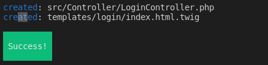
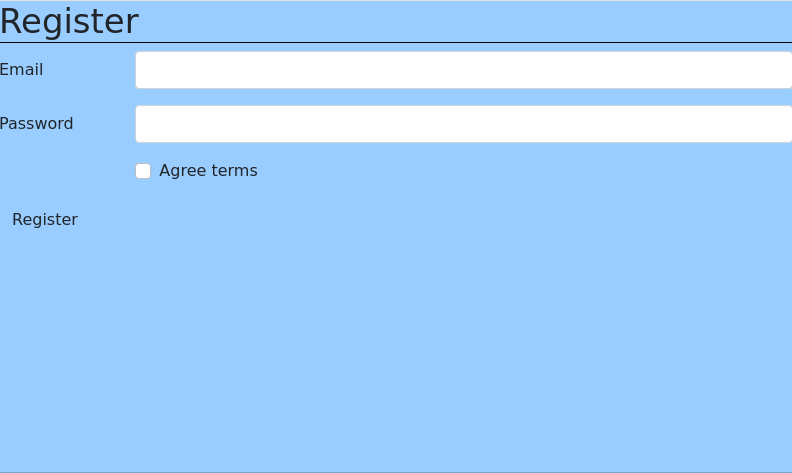

# 4. Gestión de usuarios

Symfomy ya tiene integrada la gestión de usuarios.

El primer paso es crear la entidad User usando el asistente de Symfony que se instala mediante `php bin/console make:user`

```
The name of the security user class (e.g. User) [User]:
 > User

 Do you want to store user data in the database (via Doctrine)? (yes/no) [yes]:
 > yes

 Enter a property name that will be the unique "display" name for the user (e.g. email, username, uuid) [email]:
 > email

 Will this app need to hash/check user passwords? Choose No if passwords are not needed or will be checked/hashed by some other system (e.g. a single sign-on server).

 Does this app need to hash/check user passwords? (yes/no) [yes]:
 > yes

 created: src/Entity/User.php
 created: src/Repository/UserRepository.php
 updated: src/Entity/User.php
 updated: config/packages/security.yaml
```

Este es el código generado automáticamente:

```php
<?php

namespace App\Entity;

use App\Repository\UserRepository;
use Doctrine\ORM\Mapping as ORM;
use Symfony\Component\Security\Core\User\PasswordAuthenticatedUserInterface;
use Symfony\Component\Security\Core\User\UserInterface;

/**
 * @ORM\Entity(repositoryClass=UserRepository::class)
 */
class User implements UserInterface, PasswordAuthenticatedUserInterface
{
    /**
     * @ORM\Id
     * @ORM\GeneratedValue
     * @ORM\Column(type="integer")
     */
    private $id;

    /**
     * @ORM\Column(type="string", length=180, unique=true)
     */
    private $email;

    /**
     * @ORM\Column(type="json")
     */
    private $roles = [];

    /**
     * @var string The hashed password
     * @ORM\Column(type="string")
     */
    private $password;

    public function getId(): ?int
    {
        return $this->id;
    }

    public function getEmail(): ?string
    {
        return $this->email;
    }

    public function setEmail(string $email): self
    {
        $this->email = $email;

        return $this;
    }

    /**
     * A visual identifier that represents this user.
     *
     * @see UserInterface
     */
    public function getUserIdentifier(): string
    {
        return (string) $this->email;
    }

    /**
     * @deprecated since Symfony 5.3, use getUserIdentifier instead
     */
    public function getUsername(): string
    {
        return (string) $this->email;
    }

    /**
     * @see UserInterface
     */
    public function getRoles(): array
    {
        $roles = $this->roles;
        // guarantee every user at least has ROLE_USER
        $roles[] = 'ROLE_USER';

        return array_unique($roles);
    }

    public function setRoles(array $roles): self
    {
        $this->roles = $roles;

        return $this;
    }

    /**
     * @see PasswordAuthenticatedUserInterface
     */
    public function getPassword(): string
    {
        return $this->password;
    }

    public function setPassword(string $password): self
    {
        $this->password = $password;

        return $this;
    }

    /**
     * Returning a salt is only needed, if you are not using a modern
     * hashing algorithm (e.g. bcrypt or sodium) in your security.yaml.
     *
     * @see UserInterface
     */
    public function getSalt(): ?string
    {
        return null;
    }

    /**
     * @see UserInterface
     */
    public function eraseCredentials()
    {
        // If you store any temporary, sensitive data on the user, clear it here
        // $this->plainPassword = null;
    }
}
```

El paso siguiente es realizar la migración:

```
php bin/console make:migration
php bin/console doctrine:migrations:migrate
```

## 4.1 Cargar el usuario: `User Provider`

Además de crear el usuario, también se encarga de modificar la configuración de seguridad

```yaml
# config/packages/security.yaml
security:
    # ...

    providers:
        app_user_provider:
            entity:
                class: App\Entity\User
                property: email
```

Esta configuración el indica que la clase que gestiona el usuario es `App\Entity\User` y que el campo que proporciona el login es el `email`

## 4.2 Cargar el usuario

Ya sólo nos queda generar el formulario de login. Para ello ejecutamos `php bin/console make:controller Login`



Que crea automáticamente un controlador para la ruta `login` y una plantilla.

Ahora hay que activar el formulario de login modificando la sección `form_login`

```yaml
# config/packages/security.yaml
security:
    # ...

    firewalls:
        main:
            # ...
            form_login:
                # "login" is the name of the route created previously
                login_path: login
                check_path: login
```

Y modificar el controlador para que quede así:

```php
<?php

namespace App\Controller;

use Symfony\Component\Security\Http\Authentication\AuthenticationUtils;
use Symfony\Bundle\FrameworkBundle\Controller\AbstractController;
use Symfony\Component\HttpFoundation\Response;
use Symfony\Component\Routing\Annotation\Route;

class LoginController extends AbstractController
{
    /**
     * @Route("/login", name="login")
     */
    public function index(AuthenticationUtils $authenticationUtils): Response
    {
      // get the login error if there is one
        $error = $authenticationUtils->getLastAuthenticationError();
        // last username entered by the user
        $lastUsername = $authenticationUtils->getLastUsername();

        return $this->render('login/index.html.twig', [
             'last_username' => $lastUsername,
             'error'         => $error,
        ]);
    }
}
```

Y  modificamos la plantilla:

```twig
{# templates/login/index.html.twig #}


{# ... #}


    
        <div>{{ error.messageKey|trans(error.messageData, 'security') }}</div>
    

    <form action="{{ path('login') }}" method="post">
        <label for="username">Email:</label>
        <input type="text" id="username" name="_username" value="{{ last_username }}"/>

        <label for="password">Password:</label>
        <input type="password" id="password" name="_password"/>

        {# If you want to control the URL the user is redirected to on success
        <input type="hidden" name="_target_path" value="/account"/> #}

        <button type="submit">login</button>
    </form>


```

## 4.3 Formulario de registro

Es tan sencillo como ejecutar el comando `php bin/console make:registration-form` respondiendo a las preguntas que nos propone:

```
Do you want to add a @UniqueEntity validation annotation on your User class to make sure duplicate accounts aren't created? (yes/no) [yes]:
yes
Do you want to send an email to verify the user's email address after registration? (yes/no) [yes]:
no
Do you want to automatically authenticate the user after registration? (yes/no) [yes]:
yes

What route should the user be redirected to after registration?:
  [0 ] _wdt
  [1 ] _profiler_home
  [2 ] _profiler_search
  [3 ] _profiler_search_bar
  [4 ] _profiler_phpinfo
  [5 ] _profiler_search_results
  [6 ] _profiler_open_file
  [7 ] _profiler
  [8 ] _profiler_router
  [9 ] _profiler_exception
  [10] _profiler_exception_css
  [11] nuevo_contacto
  [12] editar_contacto
  [13] insertar_sin_provincia_contacto
  [14] insertar_con_provincia_contacto
  [15] insertar_contacto
  [16] ficha_contacto
  [17] buscar_contacto
  [18] modificar_contacto
  [19] eliminar_contacto
  [20] login
  [21] page
  [22] inicio
  [23] _preview_error
 > 22
```

> **Importante**. Especificar el número que identifique la ruta `inicio` que a donde redirigirá automáticamente al registrarse

Se creará el controlador `App\Controller\RegistrationController.php` y la plantilla `registration/register.html.twig`

Ahora, si visitamos [http://localhost:8080/register](http://localhost:8080/register) mostrará el formulario de registro:



## 4.4 Logout

Para habilitar el logout, hay que activar el parámetro `logout` en la configuración de seguridad:

```yaml
    firewalls:
        ...
        main:
           ...
            logout:
                path: app_logout
```

Y crear el controlador `SecurityController.php` 

```php
<?php
namespace App\Controller;

use Symfony\Bundle\FrameworkBundle\Controller\AbstractController;
use Symfony\Component\Routing\Annotation\Route;

class SecurityController extends AbstractController
{
    /**
     * @Route("/logout", name="app_logout", methods={"GET"})
     */
    public function logout(): void
    {
        // controller can be blank: it will never be called!
        throw new \Exception('Don\'t forget to activate logout in security.yaml');
    }
}
```


## 4.5 Contenido del archivo `security.yaml`

Os dejo el contenido completo por si tenéis algún problema:

```yaml
security:
    enable_authenticator_manager: true
    # https://symfony.com/doc/current/security.html#registering-the-user-hashing-passwords
    password_hashers:
        Symfony\Component\Security\Core\User\PasswordAuthenticatedUserInterface: 'auto'
        App\Entity\User:
            algorithm: auto

    # https://symfony.com/doc/current/security.html#loading-the-user-the-user-provider
    providers:
        # used to reload user from session & other features (e.g. switch_user)
        app_user_provider:
            entity:
                class: App\Entity\User
                property: email
    firewalls:
        dev:
            pattern: ^/(_(profiler|wdt)|css|images|js)/
            security: false
        main:
            lazy: true
            provider: app_user_provider
            form_login:
                # "login" is the name of the route created previously
                login_path: login
                check_path: login
            logout:
                path: app_logout
            # activate different ways to authenticate
            # https://symfony.com/doc/current/security.html#the-firewall

            # https://symfony.com/doc/current/security/impersonating_user.html
            # switch_user: true

    # Easy way to control access for large sections of your site
    # Note: Only the *first* access control that matches will be used
    access_control:
        # - { path: ^/admin, roles: ROLE_ADMIN }
        # - { path: ^/profile, roles: ROLE_USER }

when@test:
    security:
        password_hashers:
            # By default, password hashers are resource intensive and take time. This is
            # important to generate secure password hashes. In tests however, secure hashes
            # are not important, waste resources and increase test times. The following
            # reduces the work factor to the lowest possible values.
            Symfony\Component\Security\Core\User\PasswordAuthenticatedUserInterface:
                algorithm: auto
                cost: 4 # Lowest possible value for bcrypt
                time_cost: 3 # Lowest possible value for argon
                memory_cost: 10 # Lowest possible value for argon

```
